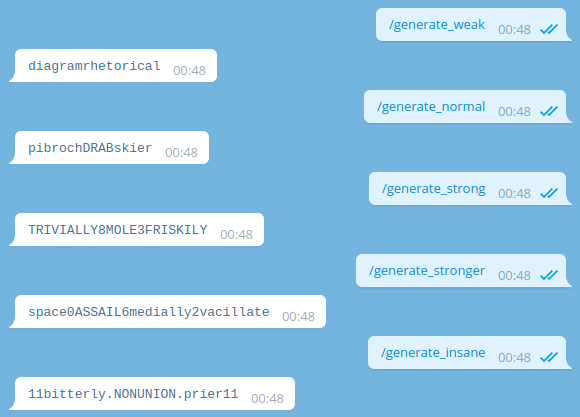
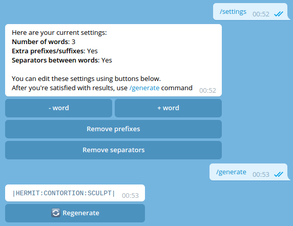
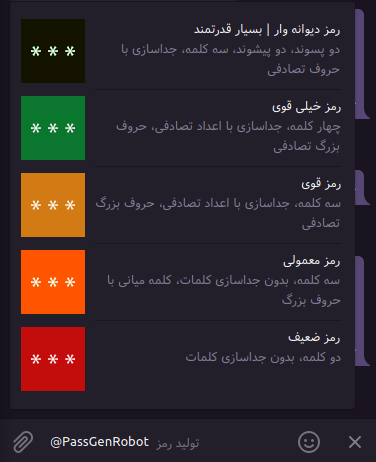

# 
  تولید کننده رمز خوانا برای تلگرام #

با کمک این ربات رمز های قدرتمند و خوانا برای برنامه ها یا وبسایت ها ایجاد کنید.
هم اکنون امتحان کنید: https://t.me/PassGenRobot
### چند ویژگی 
* Presets of different complexity
* Ability to generate customized password  
* Inline mode with colored complexity
* No personal data is collected!  
* Basic multilanguage support (En+Ru), depending on `language_code` from Bot API

Don't forget to rename `config.example.py` to `config.py` and put your data instead of stubs.

### Requirements
* Python 3.7+  
* [aiogram](https://github.com/aiogram/aiogram) – Awesome Telegram Bot API framework  
* [TinyDB](https://github.com/msiemens/tinydb) – Simple and pretty fast document-oriented DB  
* [XKCD-password-generator](https://github.com/redacted/XKCD-password-generator) – It goes without saying :)

You can install all these requirements with `pip install -r requirements.txt` command.

### Presets
 

`/generate_weak` – 2 words, no separators between words  
`/generate_normal` – 3 words, no separators between words, second word is CAPITALIZED  
`/generate_strong` – 3 words, random CAPITALIZATION, random number as separator between words   
`/generate_stronger` – Same as "strong", but using 4 words    
`/generate_insane` – 4 words, second one CAPITALIZED, separators, prefixes and suffixes  

### Customized Passwords

  

With `/settings` command you can customize generated passwords. Currently supported settings are number of words (2 to 8), prefixes and suffices in the beginning and in the end of password and separators between words in password. Then just use `/generate` command to create password based on your settings.

### Inline mode

You can also use this bot in inline mode. An indicator on the left shows rough password complexity (green is good, red is not).

